# 📊 Diagramas de Secuencia - ChatApp

Este documento contiene diagramas de secuencia detallados para los flujos principales del sistema.

## Índice
- [1. Registro de Administrador](#1-registro-de-administrador)
- [2. Login de Administrador](#2-login-de-administrador)
- [3. Creación de Sala](#3-creación-de-sala)
- [4. Usuario Entra a Sala](#4-usuario-entra-a-sala)
- [5. Envío de Mensaje](#5-envío-de-mensaje)
- [6. Edición de Mensaje](#6-edición-de-mensaje)
- [7. Eliminación de Mensaje](#7-eliminación-de-mensaje)
- [8. Subida de Archivo](#8-subida-de-archivo)
- [9. Expulsión de Usuario](#9-expulsión-de-usuario)
- [10. Control de Sesión Única](#10-control-de-sesión-única)
- [11. Desconexión por Inactividad](#11-desconexión-por-inactividad)

---

## 1. Registro de Administrador

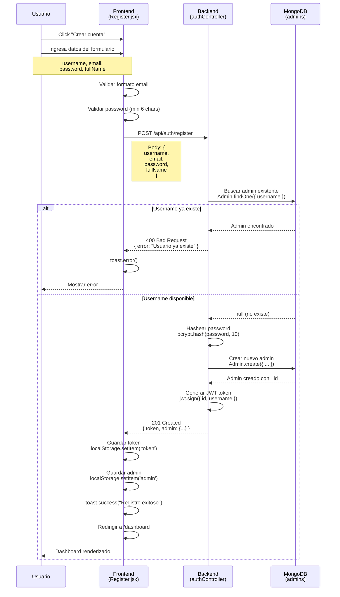

**Tiempo estimado:** 200-500ms

**Casos de error:**
- Email inválido → 400 Bad Request
- Username duplicado → 400 Bad Request
- Email duplicado → 400 Bad Request
- Password muy corto → 400 Bad Request

---

## 2. Login de Administrador

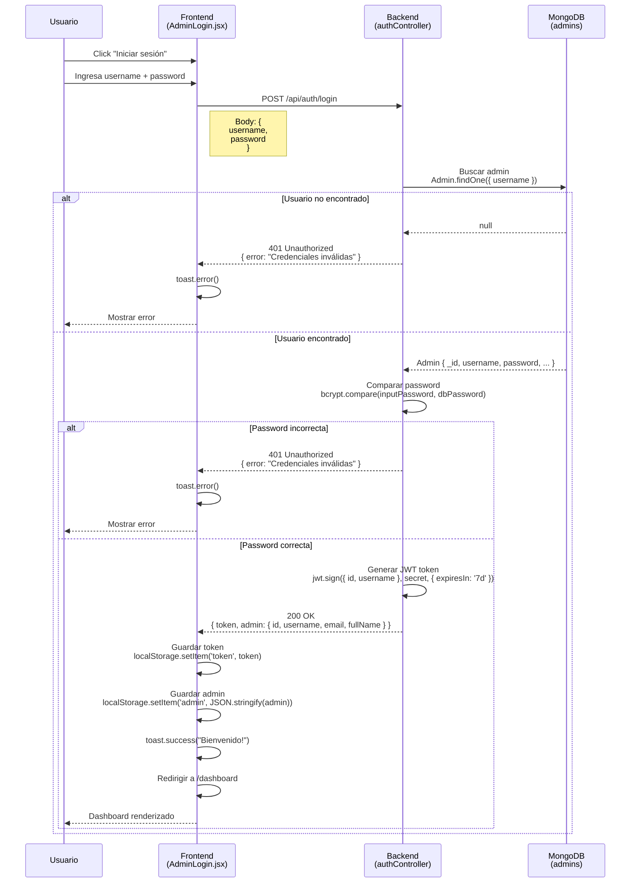

**Tiempo estimado:** 150-400ms

**Seguridad:**
- Password nunca se envía en respuesta
- Token expira en 7 días
- bcrypt con 10 salt rounds

---

## 3. Creación de Sala

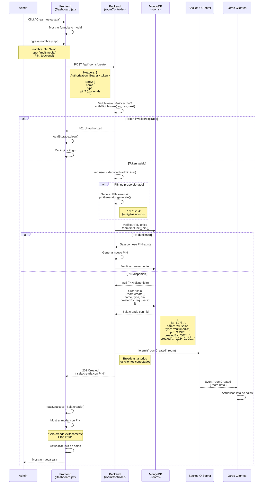

**Tiempo estimado:** 200-600ms

**Validaciones:**
- JWT requerido
- Nombre no vacío
- Tipo: 'texto' o 'multimedia'
- PIN único de 4 dígitos

---

## 4. Usuario Entra a Sala

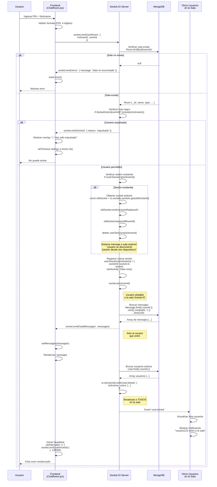

**Tiempo estimado:** 300-800ms

**Validaciones:**
- PIN de 4 dígitos
- Nickname no vacío
- Nickname único en la sala
- Usuario no expulsado

---

## 5. Envío de Mensaje

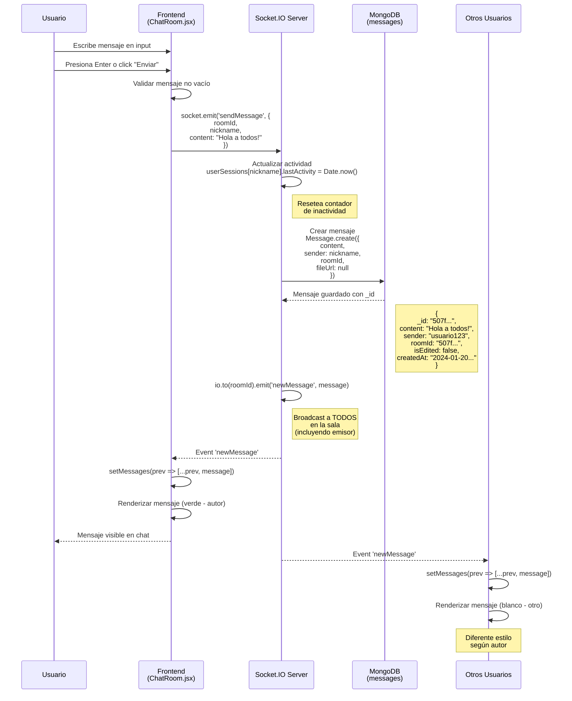

**Tiempo estimado:** 50-200ms (tiempo real)

**Características:**
- Broadcast a todos simultáneamente
- Persistido en DB antes de emitir
- Actualiza lastActivity automáticamente
- Limpieza de input después de enviar

---

## 6. Edición de Mensaje

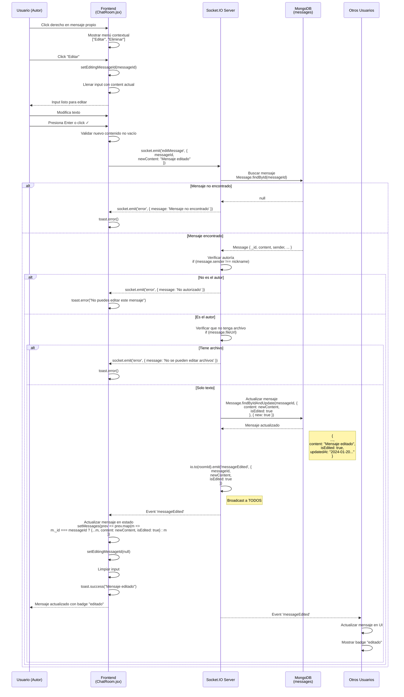

**Tiempo estimado:** 100-300ms

**Restricciones:**
- Solo el autor puede editar
- Solo mensajes de texto (no archivos)
- Badge "editado" visible para todos
- updatedAt timestamp automático

---

## 7. Eliminación de Mensaje

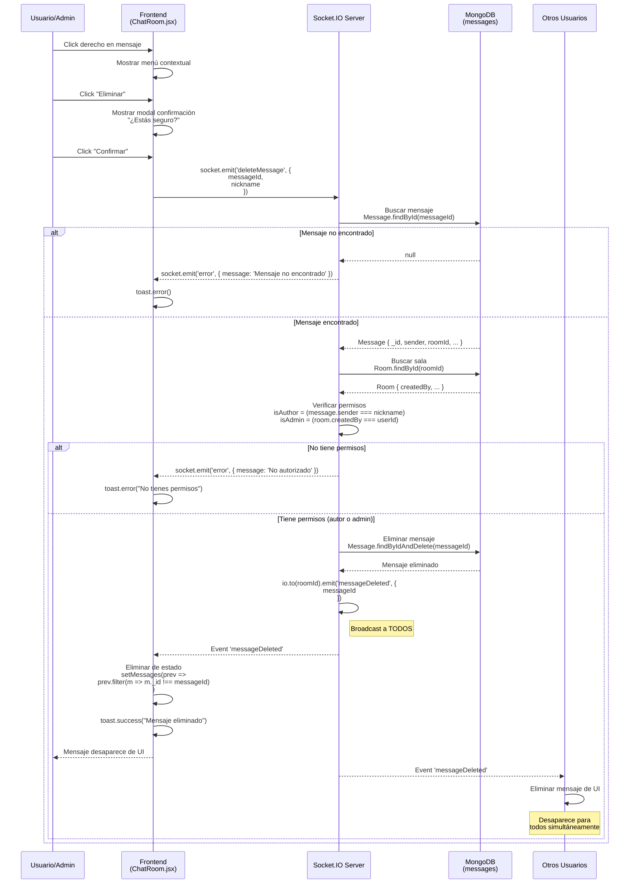

**Tiempo estimado:** 150-400ms

**Permisos:**
- Autor: Puede eliminar sus propios mensajes
- Admin de sala: Puede eliminar cualquier mensaje
- Otros: No pueden eliminar

---

## 8. Subida de Archivo

```mermaid
sequenceDiagram
    participant U as Usuario
    participant F as Frontend<br/>(ChatRoom.jsx)
    participant API as Backend API<br/>(fileController)
    participant M as Multer Middleware
    participant FS as File System<br/>(/uploads)
    participant S as Socket.IO Server
    participant DB as MongoDB<br/>(messages)
    participant O as Otros Usuarios

    U->>F: Click botón adjuntar 📎
    F->>F: <input type="file" />
    
    U->>F: Seleccionar archivo
    Note over U,F: imagen.png (2.5 MB)
    
    F->>F: Validar tipo de sala<br/>if (roomType !== 'multimedia')
    
    alt Sala de texto
        F->>F: toast.error("Esta sala no permite archivos")
        F-->>U: Error mostrado
    else Sala multimedia
        F->>F: Crear FormData<br/>formData.append('file', file)
        
        F->>API: POST /api/files/upload<br/>Content-Type: multipart/form-data
        
        API->>M: multer.single('file')
        
        M->>M: Validar tamaño<br/>if (fileSize > 50MB)
        
        alt Archivo muy grande
            M-->>F: 400 Bad Request<br/>{ error: 'Archivo muy grande' }
            F->>F: toast.error()
        else Tamaño OK
            M->>M: Validar tipo MIME<br/>Permitidos: image/*, video/*, application/pdf, etc.
            
            alt Tipo no permitido
                M-->>F: 400 Bad Request<br/>{ error: 'Tipo de archivo no permitido' }
                F->>F: toast.error()
            else Tipo permitido
                M->>M: Generar filename único<br/>timestamp + "_" + originalname
                Note right of M: 1706195400000_imagen.png
                
                M->>FS: Guardar archivo<br/>fs.writeFile('/uploads/...')
                FS-->>M: Archivo guardado
                
                M->>API: req.file = { filename, path, ... }
                
                API-->>F: 200 OK<br/>{ fileUrl: '/api/files/1706195400000_imagen.png' }
                
                F->>F: toast.success("Archivo subido")
                
                F->>S: socket.emit('sendMessage', {<br/>  roomId,<br/>  nickname,<br/>  content: '',<br/>  fileUrl: '/api/files/...'<br/>})
                
                S->>S: Actualizar lastActivity
                
                S->>DB: Crear mensaje<br/>Message.create({<br/>  content: '',<br/>  sender: nickname,<br/>  roomId,<br/>  fileUrl<br/>})
                
                DB-->>S: Mensaje guardado
                
                S->>S: io.to(roomId).emit('newMessage', message)
                
                S-->>F: Event 'newMessage'
                F->>F: Renderizar según tipo de archivo
                alt Es imagen
                    F->>F: <img src={fileUrl} />
                else Es video
                    F->>F: <video src={fileUrl} controls />
                else Es PDF
                    F->>F: <a href={fileUrl} download>📄 documento.pdf</a>
                end
                F-->>U: Archivo visible en chat
                
                S-->>O: Event 'newMessage'
                O->>O: Renderizar archivo
            end
        end
    end
```

**Tiempo estimado:** 500ms-5s (depende del tamaño)

**Validaciones:**
- Tamaño máximo: 50MB
- Tipos permitidos:
  - Imágenes: JPG, PNG, GIF, WebP, SVG
  - Videos: MP4, WebM, MOV
  - Docs: PDF, DOC, DOCX, XLS, XLSX
  - Audio: MP3, WAV, OGG
  - Comprimidos: ZIP, RAR, 7Z

---

## 9. Expulsión de Usuario

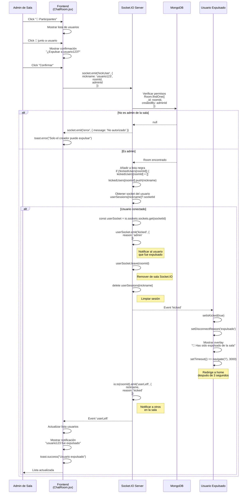

**Tiempo estimado:** 100-300ms

**Características:**
- Solo el creador de la sala puede expulsar
- Usuario añadido a lista negra (kickedUsers)
- No puede reingresar (validado en joinRoom)
- Lista negra se resetea al reiniciar servidor

**Mejora futura:** Persistir lista negra en MongoDB

---

## 10. Control de Sesión Única

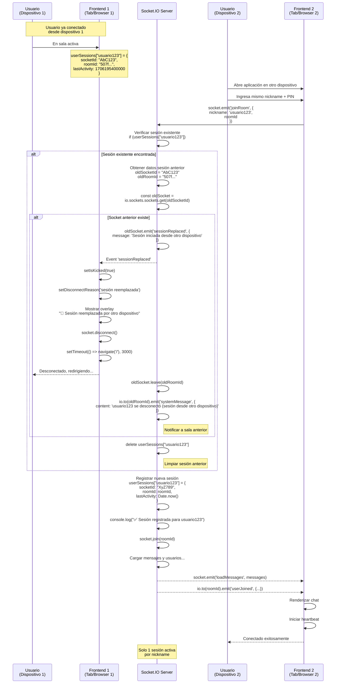

**Tiempo estimado:** 200-500ms

**Características:**
- Automático: No requiere intervención del usuario
- Desconexión suave del dispositivo anterior
- Mensaje informativo en ambos lados
- Solo una conexión activa por nickname

**Logs del servidor:**
```
🔄 usuario123 reemplazó su sesión anterior
✅ Sesión registrada para usuario123 - Socket: XyZ789 - Sala: 507f...
```

---

## 11. Desconexión por Inactividad

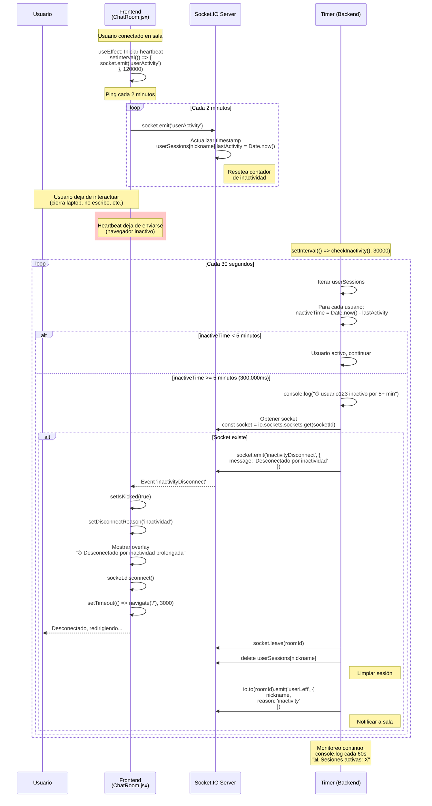

**Configuración:**
- **Timeout**: 5 minutos sin actividad
- **Check Interval**: Cada 30 segundos
- **Heartbeat Client**: Cada 2 minutos
- **Actividad detectada en**:
  - Envío de mensaje
  - Escribir en input
  - Heartbeat automático
  - Entrar a sala

**Tiempo desde inactividad hasta desconexión:** ~5 minutos

**Logs del servidor:**
```
⏰ usuario123 inactivo por 305 segundos - Desconectando...
📊 Sesiones activas: 12
  👤 usuario456 - Inactivo: 45s - Sala: 507f...
  👤 usuario789 - Inactivo: 120s - Sala: 507f...
```

---

## Resumen de Tiempos

| Operación | Tiempo Estimado | Tipo |
|-----------|----------------|------|
| Registro | 200-500ms | HTTP |
| Login | 150-400ms | HTTP |
| Crear Sala | 200-600ms | HTTP + WS |
| Entrar a Sala | 300-800ms | WebSocket |
| Enviar Mensaje | 50-200ms | WebSocket |
| Editar Mensaje | 100-300ms | WebSocket |
| Eliminar Mensaje | 150-400ms | WebSocket |
| Subir Archivo | 500ms-5s | HTTP |
| Expulsar Usuario | 100-300ms | WebSocket |
| Reemplazar Sesión | 200-500ms | WebSocket |
| Desconexión Inactividad | ~5 minutos | Background |

---

## Eventos Socket.IO

### Cliente → Servidor

| Evento | Payload | Descripción |
|--------|---------|-------------|
| `joinRoom` | `{ nickname, roomId }` | Entrar a sala |
| `sendMessage` | `{ roomId, nickname, content, fileUrl? }` | Enviar mensaje |
| `editMessage` | `{ messageId, newContent }` | Editar mensaje |
| `deleteMessage` | `{ messageId, nickname }` | Eliminar mensaje |
| `kickUser` | `{ nickname, roomId, adminId }` | Expulsar usuario (admin) |
| `userActivity` | `{}` | Heartbeat (mantener activo) |
| `disconnect` | `{}` | Desconexión (automático) |

### Servidor → Cliente

| Evento | Payload | Descripción |
|--------|---------|-------------|
| `loadMessages` | `[{ _id, content, sender, ... }]` | Cargar historial |
| `newMessage` | `{ _id, content, sender, ... }` | Nuevo mensaje (broadcast) |
| `messageEdited` | `{ messageId, newContent, isEdited }` | Mensaje editado (broadcast) |
| `messageDeleted` | `{ messageId }` | Mensaje eliminado (broadcast) |
| `userJoined` | `{ nickname, users: [...] }` | Usuario entró (broadcast) |
| `userLeft` | `{ nickname, reason? }` | Usuario salió (broadcast) |
| `kicked` | `{ reason }` | Expulsado por admin |
| `sessionReplaced` | `{ message }` | Sesión reemplazada |
| `inactivityDisconnect` | `{ message }` | Desconectado por inactividad |
| `systemMessage` | `{ content }` | Mensaje del sistema |
| `error` | `{ message }` | Error general |

---

**Última actualización:** Noviembre 2025

**Nota:** Estos diagramas están diseñados para ser renderizados con Mermaid. Puedes visualizarlos en:
- GitHub (renderizado automático)
- VS Code con extensión "Markdown Preview Mermaid Support"
- [Mermaid Live Editor](https://mermaid.live/)
